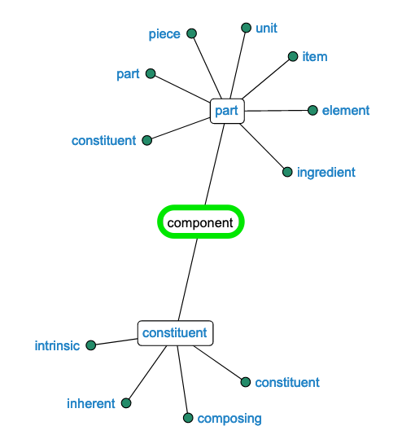

# Design System

> You should be barely writing CSS to make a web-page.
> Also, what if you dont have to write the markup itself?

A Design System is a set of interconnected patterns and shared practices coherently organized.[1] Design Systems aid in digital product design and development of products such as apps or websites. They may contain, but are not limited to, pattern libraries, design languages, style guides, coded components, brand languages, and documentation.

| what is DS  | examples                                                   |
| ----------- | ---------------------------------------------------------- |
| rules       | must pass minimum color contrast ration of `4:5:1`         |
| constraints | number of colors in palette                                |
| principles  | color should be used in meaningful way, red, yellow, green |

Component -> Page Layout -> Interaction Model

1. [ ] color system | palette
2. [ ] Semantic html
3. [ ] accessibility, color contrast, sizing
4. [ ] responsiveness
5. [ ] Material UI specification
6. [ ] rich SEO text structure
7. [ ] prototyping
8. [ ] tracking enabled, forms, button-clicks
9. [ ] work on design programs, like invision, figma

### What are they?

> All systems are build using some micro-systems which works behind them

- [NASA standard manuals](https://standardsmanual.com/)
- Parts of a DS
  - Typography
  - Color Palettes
  - Spacing scale, like 4,5 or 8px
  - Components
  - Page Layouts
  - Interaction models
  - voice, tone and words

## Features

- system theme, dark and light mode
- Adjust padding based on screen resolution size

### [primer/css - github's css system](https://github.com/primer/css)

- uses [SCSS](https://sass-lang.com/documentation/syntax#scss) css pre-processor

| structure  | description                                  |
| ---------- | -------------------------------------------- |
| core       | basic HTML blocks like table, links          |
| product    | alerts, modals, dialogues, cards, navigation |
| marketting | usp, cta button, highlight, special offer    |

- https://youtu.be/Hx02SaL_IH0

### Resources

- https://github.com/topics/component-library
- https://github.com/topics/design-systems
- https://github.com/alexpate/awesome-design-systems
