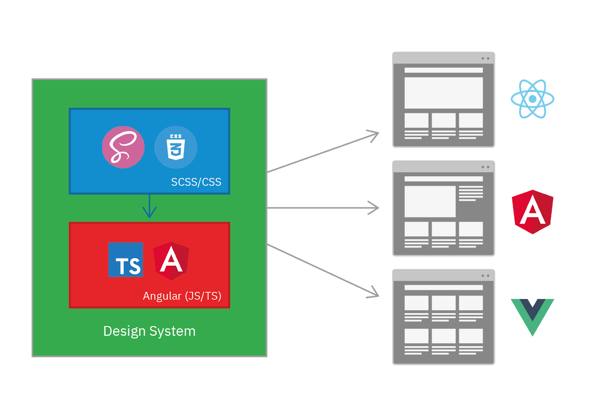

# How to build a DS?

Build a **Component Library**, as in
**angular material** is for angular
**Vuetify** is for vuejs

- seperation of concern
- increase modularity

# Parts of a DS

single source of truth

1. Component Library for creating [web components](https://en.wikipedia.org/wiki/Web_Components)
   1. should be usable in any UI framework
   2. promote HTML Encapsulation + interportability
   3. compile to web components, specifications?
      1. [HTML Template specification](https://html.spec.whatwg.org/multipage/scripting.html#the-template-element)
      2. The ES Module specification
      3. [Shadow DOM specification](https://html.spec.whatwg.org/multipage/)
      4. [custom element specification, js libraries like `react-dom`, `jQuery`, `vue`
2. CSS Core - css is cheap, js is expensive

